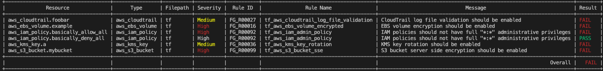
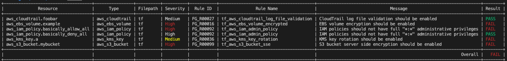
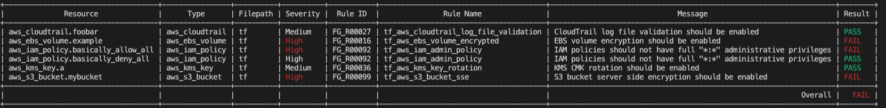
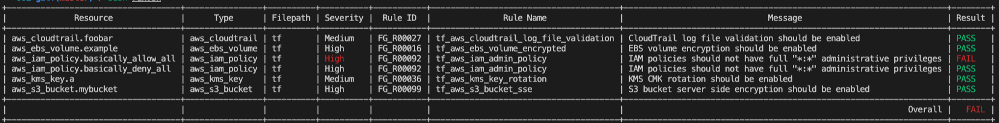
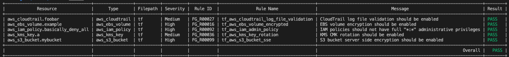

# 001 - introduction 

In this exercise, we are going to run the Regula tool on a set of Terraform resources. No custom rules have been defined, only those included with regula.

## Resources 

## Terraform 

Included in the `tf` directory are a set of AWS resources, implemented using Terraform. Have a browse of the files.

## Running Regula

Run the following command:

`regula run tf --format table`

This tell Regula to evaluate the built in rule set against the Terraform code contained in the `tf` directory, and output it as a table. The default output of Regula is JSON which can be useful in Continuous Integration pipelines as it is machine readable.

However, as we are running Regula via the CLI, it makes sense to output in a pretty table format.

### Built in Rules

This table shows the built in rule sets that ships with Regula:

|Service|Rule|Description|Resource|   |
|---|---|---|---|---|
|cloudfront|tf_aws_cloudfront_distribution_https|CloudFront viewer protocol policy should be set to https-only or redirect-to-https. CloudFront connections should be encrypted during transmission over networks that can be accessed by malicious individuals. A CloudFront distribution should only use HTTPS or Redirect HTTP to HTTPS for communication between viewers and CloudFront.|   |   |
|cloudtrail|tf_aws_cloudtrail_log_file_validation|CloudTrail log file validation should be enabled. It is recommended that file validation be enabled on all CloudTrail logs because it provides additional integrity checking of the log data.|   |   |
|ebs|tf_aws_ebs_volume_encrypted|EBS volume encryption should be enabled. Enabling encryption on EBS volumes protects data at rest inside the volume, data in transit between the volume and the instance, snapshots created from the volume, and volumes created from those snapshots. EBS volumes are encrypted using KMS keys.|   |   |
|iam|tf_aws_iam_admin_policy|IAM policies should not have full \"*:*\" administrative privileges. IAM policies should start with a minimum set of permissions and include more as needed rather than starting with full administrative privileges. Providing full administrative privileges when unnecessary exposes resources to potentially unwanted actions.|   |   |
|iam|tf_aws_iam_user_attached_policy|IAM policies should not be attached to users. Assigning privileges at the group or role level reduces the complexity of access management as the number of users grow. Reducing access management complexity may reduce opportunity for a principal to inadvertently receive or retain excessive privileges.|   |   |
|kms|tf_aws_kms_key_rotation|"KMS CMK rotation should be enabled. It is recommended that users enable rotation for the customer created AWS Customer Master Key (CMK). Rotating encryption keys helps reduce the potential impact of a compromised key as users cannot use the old key to access the data.|aws_kms_key|   |
|s3|tf_aws_s3_bucket_sse|S3 bucket server side encryption should be enabled. Enabling server-side encryption (SSE) on S3 buckets at the object level protects data at rest and helps prevent the breach of sensitive information assets. Objects can be encrypted with S3-Managed Keys (SSE-S3), KMS-Managed Keys (SSE-KMS), or Customer-Provided Keys (SSE-C).|aws_s3_bucket|   |
|security_group|tf_aws_security_group_ingress_anywhere|VPC firewall rules should not permit unrestricted access from the internet, with the exception of port 80 (HTTP) and port 443 (HTTPS). Web applications or APIs generally need to be publicly accessible.|aws_security_group|   |
|security_group|tf_aws_security_group_ingress_anywhere_rdp|VPC security group rules should not permit ingress from '0.0.0.0/0' to TCP/UDP port 3389 (Remote Desktop Protocol). VPC security groups should not permit unrestricted access from the internet to port 3389 (RDP). Removing unfettered connectivity to remote console services, such as Remote Desktop Protocol, reduces a server's exposure to risk.|aws_security_group|   |
|security_group|tf_aws_security_group_ingress_anywhere_ssh|VPC security group rules should not permit ingress from '0.0.0.0/0' to TCP/UDP port 22 (SSH). VPC security groups should not permit unrestricted access from the internet to port 22 (SSH). Removing unfettered connectivity to remote console services, such as SSH, reduces a server's exposure to risk.|aws_security_group|   |
|vpc|tf_aws_vpc_flow_log|   |   |   |

## Making resources compliant

In each Terraform file (*.tf) you should see lines beginning with `#`. This is a comment within the Terraform language.

To make the resource compliant with the rule, uncomment the line by removing the `#` and re-run the Regula command.

Note: the IAM.tf resources do not follow this pattern, one is valid and one is invalid which you can compare. 

To make this file pass, comment out all lines on the first resource definition(cmd + / OR control + /)

Initial run:

After enabling log file validation on CloudTrail [tf/cloudtrail.tf](tf/cloudtrail.tf):

After enabling key rotation on the KMS key [tf/kms.tf](tf/kms.tf):

After enabling encryption on the EBS volume [tf/ebs.tf](tf/ebs.tf):

When all rules are valid, you should see this output:

