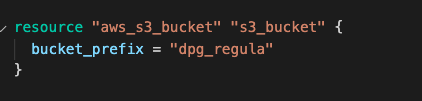
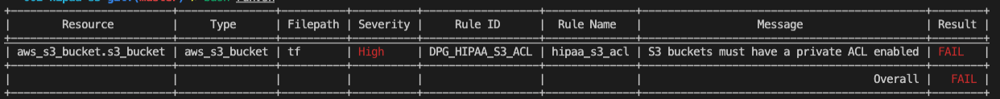
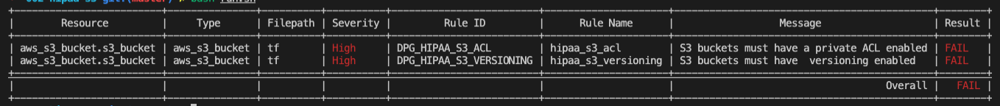
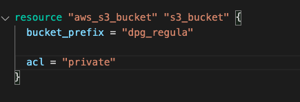
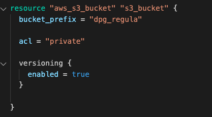

# 002 - S3 bucket HIPAA compliance

In this use case, you are provided with a set of Terraform scripts, as well as a Regula custom rule implemented using OPA.

The goal of this exercise is to familiarise yourself with implementing custom Regula rules using the OPA Rego language.

We will be implementing a real world example of Compliance, in this case using [HIPAA](https://aws.amazon.com/compliance/hipaa-compliance/).

From AWS:

```
The Health Insurance Portability and Accountability Act of 1996 (HIPAA) is legislation that is designed to make it easier for US workers to retain health insurance coverage when they change or lose their jobs. The legislation also seeks to encourage electronic health records to improve the efficiency and quality of the US healthcare system through improved information sharing.
```


## S3 Buckets

AWS S3 is the Simple Storage Service, an object based storage service. Objects are contained in buckets.

In the `tf` directory there is a file caled s3_bucket.tf. In this is an S3 bucket written in Terraform:




## Custom Rules

We will begin by implementing two custom rules.

| Rule ID | Rule Description | Rule Scope |
| ------- | ---------------- | ---------- |
| DPG_HIPAA_S3_ACL | S3 buckets must have a private ACL enabled | aws_s3_buckets - access controls |
| DPG_HIPAA_S3_VERSIONING | S3 buckets must have  versioning enabled | aws_s3_buckets - encryption |

### Creating the ACL rule

Within the `policy` directory, create a new file called `hipaa_s3_acl.rego` and copy-and-paste the following content:

```Open Policy Agent
# S3 buckets must have a private ACL enabled.
package rules.hipaa_s3_acl

# Meta documentation, displayed in test output
__rego__metadoc__ := {
  "id": "DPG_HIPAA_S3_ACL",
  "title": "S3 buckets must have a private ACL enabled",
  "description": "S3 buckets must have a private ACL enabled",
  "custom": {
    "severity": "High"
  }
}

# Tells us which resource type is in scope
resource_type = "aws_s3_bucket"

# By default, fail by saying `allow is false`
default allow = false


# When private ACL is enabled, succeed by saying `allow is true`
allow {
  # Compare the `acl` argument value of the aws_s3_bucket with the "private" setting
  input.acl == "private"
}
```

You can now test the rule by running the following command:

`regula run -u  --include policy tf --format table`

This should output:



### Creating the Versioning Rule

### Creating the ACL rule

Within the `policy` directory, create a new file called `hipaa_s3_versioning.rego` and copy-and-paste the following content:

```Open Policy Agent
# S3 buckets must have a private ACL enabled.
package rules.hipaa_s3_versioning

# Meta documentation, displayed in test output
__rego__metadoc__ := {
  "id": "DPG_HIPAA_S3_VERSIONING",
  "title": "S3 buckets must have  versioning enabled",
  "description": "S3 buckets must have versioning enabled",
  "custom": {
    "severity": "High"
  }
}

# Tells us which resource type is in scope
resource_type = "aws_s3_bucket"

# By default, fail by saying `allow is false`
default allow = false


# When private ACL is enabled, succeed by saying `allow is true`
allow {
  # Compare the `acl` argument value of the aws_s3_bucket with the "private" setting
  input.versioning 
}
```

You can now test the rule by running the following command:

`regula run -u  --include policy tf --format table`

This should output:



## Test out our rules

Now that we have implemented our rulesets, we can go ahead and execute Regula. This time we will specify the `include` option which tells Regula to include a set of rules in the location provided. We are also using the `-u` option to disable the built in ruleset.

```bash
$ regula run -u  --include policy --format table tf 
```

## Make it pass 

### Attach a private ACL 

#### What is an ACL?

Amazon S3 access control lists (ACLs) enable you to manage access to buckets and objects. Each bucket and object has an ACL attached to it as a subresource. It defines which AWS accounts or groups are granted access and the type of access. When a request is received against a resource, Amazon S3 checks the corresponding ACL to verify that the requester has the necessary access permissions.

- [AWS: ACL overview](https://docs.aws.amazon.com/AmazonS3/latest/userguide/acl-overview.html)

ACLs are used to determine who can access the objects within an S3 bucket. ACLs support complex implementations, however there are some canned ACLs which can be used by all S3 buckets.

#### Canned ACLs

| Canned ACL                | Applies to        | Permissions added to ACL                                                                                                                                                                                                                |
| ------------------------- | ----------------- | --------------------------------------------------------------------------------------------------------------------------------------------------------------------------------------------------------------------------------------- |
| private                   | Bucket and object | Owner gets FULL\_CONTROL. No one else has access rights (default).                                                                                                                                                                      |
| public-read               | Bucket and object | [Owner gets FULL\_CONTROL. The AllUsers group (see Who is a grantee?) gets READ access.](https://docs.aws.amazon.com/AmazonS3/latest/userguide/acl-overview.html#specifying-grantee)                                                    |
| public-read-write         | Bucket and object | Owner gets FULL\_CONTROL. The AllUsers group gets READ and WRITE access. Granting this on a bucket is generally not recommended.                                                                                                        |
| aws-exec-read             | Bucket and object | Owner gets FULL\_CONTROL. Amazon EC2 gets READ access to GET an Amazon Machine Image (AMI) bundle from Amazon S3.                                                                                                                       |
| authenticated-read        | Bucket and object | Owner gets FULL\_CONTROL. The AuthenticatedUsers group gets READ access.                                                                                                                                                                |
| bucket-owner-read         | Object            | Object owner gets FULL\_CONTROL. Bucket owner gets READ access. If you specify this canned ACL when creating a bucket, Amazon S3 ignores it.                                                                                            |
| bucket-owner-full-control | Object            | Both the object owner and the bucket owner get FULL\_CONTROL over the object. If you specify this canned ACL when creating a bucket, Amazon S3 ignores it.                                                                              |
| log-delivery-write        | Bucket            | [The LogDelivery group gets WRITE and READ\_ACP permissions on the bucket. For more information about logs, see (Logging requests using server access logging).](https://docs.aws.amazon.com/AmazonS3/latest/userguide/ServerLogs.html) |

We will use the `private` ACL, to ensure that by default nobody has access to our S3 bucket but ourselves.

#### Enabling via Terraform 

From the [Terraform documentation](https://registry.terraform.io/providers/hashicorp/aws/latest/docs/resources/s3_bucket#versioning)

```
acl - (Optional) The canned ACL to apply. Valid values are private, public-read, public-read-write, aws-exec-read, authenticated-read, and log-delivery-write. Defaults to private. Conflicts with grant.
```

Go to our `aws_s3_bucket` resource in the `main.tf` and add the following argument:

```terraform
acl = "private"
```

Your resource should now look like this:



Once you have applied this code change, go back and run the following command in the your terminal to view the latest test results:

```bash
$ regula run -u  --include policy --format table tf 
```

Which should give the following output:


### Versioning

[AWS supports enabling versioning](https://docs.aws.amazon.com/AmazonS3/latest/userguide/bucket-encryption.html) on S3 buckets. This means that when an object is replaced on a bucket, the old version of this object is retained.

#### Enabling via Terraform

Teraform supports creating multiple encryption rules for a given S3 bucket, via the `server_side_encryption_configuration` argument.

From the [Terraform documentation](https://registry.terraform.io/providers/hashicorp/aws/latest/docs/resources/s3_bucket#server_side_encryption_configuration):

```
The versioning object supports the following:

enabled - (Optional) Enable versioning. Once you version-enable a bucket, it can never return to an unversioned state. You can, however, suspend versioning on that bucket.
mfa_delete - (Optional) Enable MFA delete for either Change the versioning state of your bucket or Permanently delete an object version. Default is false. This cannot be used to toggle this setting but is available to allow managed buckets to reflect the state in AWS
```

#### Enable encryption on our bucket

To enable versioning, attach the following parameters to the s3_bucket resource:

```terraform
versioning {
  enabled = true
}
```

Now that versioning and ACLs are applied, your resource should look like this:

